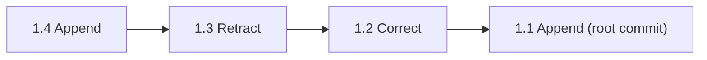
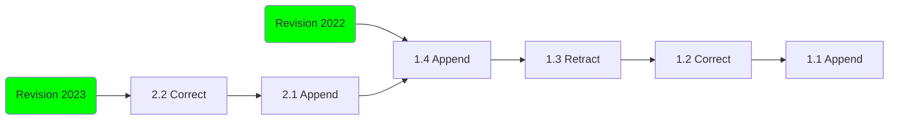
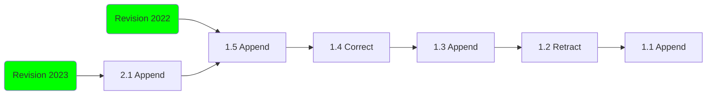
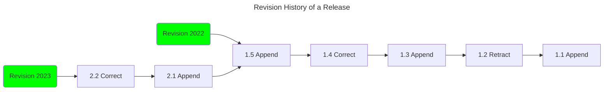

# Datahost Data Model

This document aims to describe the high level entities of the data model and the relationships between them, and how the model is used to support the publishing of versioned statistical datasets.

Some terms have different meanings in different domains (e.g. "release" as used by some statisticians, and as typically used in software development). This document aims to clarify terms used across the codebase and in discussions with stakeholders. It should also aid in defining our data model, the _verbs_ and the _nouns_ of the built software.

## Definitions

[Series](#series), [Releases](#release), [Revisions](#revision) and [Commits](#commit) are the primary entities we are concerned with in the datahost data model.  We describe them below in a bottom up manner.

### Commit

Commit's form a linear ordered succession of changes, and represent at a granular level the sequence of changes to a revision. Each commit associates some data (rows) with an operation (append, retract or correction). The commit log when replayed in order from the root commit to the head of revision is used to materialise the state of the dataset upto the last commit in the revisions range.

In datahost we currently assume that history is always linear, and that commits have either 0 or 1 parents. A root commit or initial commit is a commit with 0 parent commits.

Datahost supports three kinds of commit, appends, deletes and corrections. Appends add more rows into the logical dataset, whilst retracts remove the specified rows from the dataset. Corrections are a special operation used to express the change of a measure value, and are expressed internally as a retract followed by an append, but in addition store a reference to the previous row ID, allowing users of the transaction data to identify corrected figures, where the identities of the observations were unchanged.

Each kind of commit, references a single table of data which should be applied with the commits operation.  This means that each commit operation may apply many rows of changes at once.

The diagram below shows a succession of commits, each pointing to its parent commit:



Commits form an immutable foundation of the data model, help communicate complex changes to consumers, and ensure we can unambiguously refer to the state of a dataset at any point in its history.  By replaying the list of commits in reverse order we can reconstruct the state of the dataset at any point in time.

### Revision

Commits on their own aren't enough though, we use Revisions to name and identify a succession of commits which trace back to the ancestral root commit.  Revisions (without a successor) are best thought of as mutable pointers to the head commit of that revision, creating a commit in a revision updates the revision to point to the new commit.  Put another way revisions identify a range of commits from the head commit, to the ancestral root commit.

This is what the data model looks like with two revisions (`2022`, and `2023`), sharing a history:




Revisions allow consumers of a dataset to stay upto date with schema compatible ammendments to a dataset.

Datahost will currently prevent you from putting commits in a revision which has a successor revision.  This is currently necessary to prevent revisions diverging without a [merge mechanism](https://github.com/Swirrl/datahost-prototypes/issues/289), we may [relax this restriction](https://github.com/Swirrl/datahost-prototypes/issues/288) in the future.

### Release

"Release" (in this context) is a term from ONS / stats publishing world. A 'statistical release' represents some data being released to the outside world. But unlike a book or a software release, there's no finality in a statistical release: the data associated with a 'statistical release' can be revised or changed over time.

The release itself doesn't contain any data. Users add/update/delete data via [revisions](#revision).

When users ask for the data in a ‘statistical release’ it’s equivalent to  downloading the dataset’s contents (in old PMD parlance) - full replay of the revision history up to the latest [revision](#revision) for that statistical release.

Each release can have a schema associated with it. That schema is immutable. If the fundamental structure of the data changes so that data can’t be compared any more, statisticians make a new statistical ‘release.’

### Series

A series is a collection of related statistical [releases](#release).

### Dataset

The term Dataset doesn't really have a datahost specific meaning, a Dataset in datahost could refer to either a `DatasetSeries`, a `Release` or a `Revision`.

In DCAT terms a `DatasetSeries` is always also considered a `Dataset` as it is a subclass of it; whilst datahost's `Release`'s or `Revision`'s could also optionally be modelled as `dcat:Dataset`'s.  At the moment datahost is agnostic to this point, as the distinction isn't fundamentally important to Datahosts versioning model.  Applications of Datahost can currently decide themselves exactly which entitites to catalog.

## Entity Diagram

Below is a diagram describing the conceptual model between entities.  NOTE this diagram is intended to describe the rough high-level design, and the relationships between the main entities of the versioning model, not the specifics of the implementation.

The main thing to note is that series have many releases, releases
have many revisions, and revisions have commits/changes.

```mermaid
erDiagram
    CATALOG ||--o{ DATASET_SERIES : has

    CATALOG {
        string title
        string description
    }

    DATASET_SERIES {
        string title
        string slug_id
        string description
        dateTime created
        dateTime modified
    }

    RELEASE {
        string title
        string slug_id
        string description
        dateTime created
        dateTime modified
    }

    SCHEMA {
        int id
        string columns
        dateTime created
        dateTime modified
    }

    REVISION {
        int id
        string title
        string description
    }

    COMMIT {
        int id
        string message
        dateTime created
        string changeKind
        file changes
    }

    DATASET_SERIES ||--o{ RELEASE : has
    RELEASE ||--o{ REVISION : has
    RELEASE ||--o| SCHEMA : has
    REVISION ||--o{ COMMIT : has
``**

# Revisions & Commits explained

**TODO: Revise or remove this section, perhaps turn it into a guide**

Here we assume a dataset series and a release have already been
created, and a schema attached.

A publisher then creates a new revision within that release called the
`2022 Revision` (representing the year of publication). The name here
is arbitrary, but it is common in statistics to identify revisions of
datasets by a year or appropriate time period.

The state of the timeline now looks like this as we haven't added any
data into that revision yet:

```mermaid
flowchart LR
   R1(Revision 2022)
   style R1 fill:#0f0
```

Next the user needs to provide some data, they add some new data in an
append change/commit:


At this point we can see datahost has assigned an internal ID of `1`
to the revision and a commit ID of `1`, creating a composite ID of
`1.1`

If the publisher were to look at the 2022 Revision in this state it
would contain all of the data provided in commit `1.1`.

_NOTE: identifiers for revisions and commits should be considered opaque, and
users should not assume that they will always be identified by
integers._

The user then makes some more changes as they prepare the 2022
revision of the data; they do this by introducing some more commits in
the form of appends, retracts and corrections. These can be seen as
commits 1.2, 1.3, 1.4 and 1.5:


If a user were now to ask for the data in Revision 2022 they would see
the state of the data at `1.5`, which would be equivalent to applying
the commits `1.1`, `1.2`, `1.3`, `1.4` and `1.5` in order.

The user is happy with this and the changes are published. Currently
publishing in Datahost occurs immediately, but the plan is to
[integrate a workflow draft/publication management
system](https://github.com/Swirrl/datahost-prototypes/issues/287) like
drafter.

A year passes without updates and the dataset is due its next update.
The publisher then creates the `2023 Revision`, and appends the new
figures into it:



At this point we can see that `Revision 2023` contains the new commit
`2.1`, but and here's the important point, it also contains all the
commits from `Revision 2022`, as there is a succession of commits from
`2022` to `2023`.

In datahost we currently assume that `Revisions` always occur in a
succession like this.

Once a revision is followed by a successor, it is considered closed
for future updates, and attempting to add more commits to it is
considered an error. There is an issue to consider supporting
non-successive revisions, though this may be resolved by adopting a
[different design](https://github.com/Swirrl/datahost-prototypes/issues/256) for
the relationship between commits and revisions.

After `2.1` is published the publisher may continue to make further
commits to the Revision 2023.



