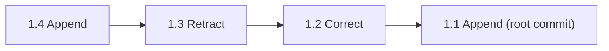
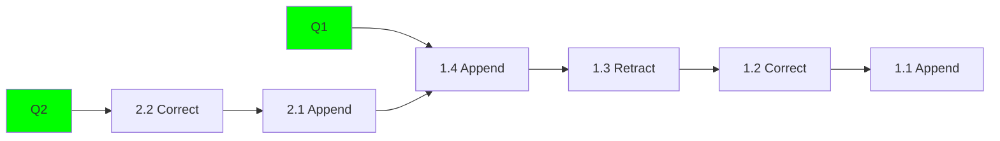
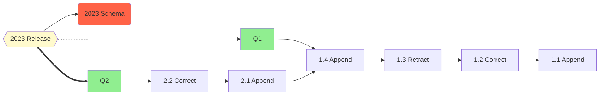
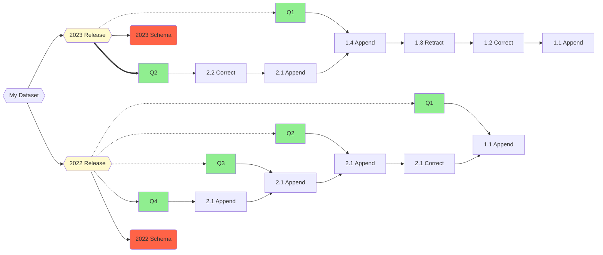
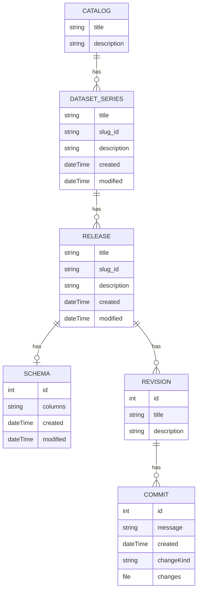

# Datahost Data Model

This document aims to describe the high level entities of the data model and the relationships between them, and how the model is used to support the publishing of versioned statistical datasets.

Some terms have different meanings in different domains (e.g. "release" as used by some statisticians, and as typically used in software development). This document aims to clarify terms used across the codebase and in discussions with stakeholders. It should also aid in defining our data model, the _verbs_ and the _nouns_ of the built software.

- [Definitions](#definitions)
  - [Commit](#commit)
  - [Revision](#revision)
  - [Release](#release)
  - [Dataset Series](#dataset-series)
  - [Dataset](#dataset)
- [Entity Diagram](#entity-diagram)

## Definitions

[Series](#series), [Releases](#release), [Revisions](#revision) and [Commits](#commit) are the primary entities we are concerned with in the datahost data model.  We describe them below in a bottom up manner.

### Commit

Commit's form a linear ordered succession of changes, and represent at a granular level the sequence of changes to a revision. Each commit associates some data (rows) with an operation (append, retract or correction). The commit log when replayed in order from the root commit to the head of revision is used to materialise the state of the dataset upto the last commit in the revisions range.

In datahost we currently assume that history is always linear, and that commits have either 0 or 1 parents. A root commit or initial commit is a commit with 0 parent commits.

Datahost supports three kinds of commit, appends, deletes and corrections. Appends add more rows into the logical dataset, whilst retracts remove the specified rows from the dataset. Corrections are a special operation used to express the change of a measure value, and are expressed internally as a retract followed by an append, but in addition store a reference to the previous row ID, allowing users of the transaction data to identify corrected figures, where the identities of the observations were unchanged.

Each kind of commit, references a single table of data which should be applied with the commits operation.  This means that each commit operation may apply many rows of changes at once.

The diagram below shows a succession of commits, each pointing to its parent commit:

Commits form an immutable foundation of the data model, help communicate complex changes to consumers, and ensure we can unambiguously refer to the state of a dataset at any point in its history.  By replaying the list of commits in reverse order we can reconstruct the state of the dataset at any point in time.

Commits can be used to communicate to users how a dataset was made, sometimes that process might be a little messy, but commits let publishers structure changes to group related changes together.

Each commit can have a message and other metadata associated with it.

### Revision

Commits on their own aren't enough though, as they can be too granular and fine grained to communicate the changes we intend to users.

Revisions let us promote certain groups of commits in the history as representing coherent revisions of data, rather than just partial changes.  We can annotate revisions separately to describe at a high level what the revisions contents will be, whilst the low level commits can describe how the changes in the revision were assembled.

Revisions name and identify and tag a succession of commits which trace back to the ancestral root commit.

You can think of revisions like tags in git, except that you need to create them before commiting to them.

Sometimes in the domain of official statistics, revisions are referred to as editions.

Revisions without a successor can be thought of as mutable pointers to the head commit of that revision, creating a commit in a revision updates the revision to point to the new commit.  Put another way revisions identify a range of commits from the head commit, to the ancestral root commit.

This is what the data model looks like with two revisions (`Q1`, and `Q2`), sharing a history:

Revisions allow consumers of a dataset to stay upto date with schema compatible ammendments to a dataset, and from a consumers perspective represent a stable published name for a snapshot of the data.

Datahost will currently prevent you from putting commits in a revision which has a successor revision.  This is currently necessary to prevent revisions diverging without a [merge mechanism](https://github.com/Swirrl/datahost-prototypes/issues/289), we may [relax this restriction](https://github.com/Swirrl/datahost-prototypes/issues/288) in the future.

### Release

"Release" (in this context) is a term from ONS / stats publishing world. A 'statistical release' represents some data being released to the outside world. But unlike a book or a software release, there's no finality in a statistical release: the data associated with a 'statistical release' can be revised or changed over time.

Much of Datahost's value is in providing consumers of official statistics some guarantees around the allowed scope of those changes, and visibility into what changed when.  We use the Release to help provide these guarantees and manage this process, by requiring releases also attach a schema to the data.

The combination of Release and Schema, can then be used to make users the guarantee that datasets will be compatible across revisions.

A release points to many revisions, but also knows which one is the latest.

The diagram below updates our example with a `2023 Release`, which points to a `2023 Schema`, the latest `Q2` revision (indicated in bold), and all other revisions `Q1` which have occurred within that release:

### Dataset Series

Finally we get to the `DatasetSeries`, this provides the required context to understand all of the above.  In particular it provides the common name for the dataset (with versioning and compatability issues delegated to Releases, Revisions and Commits).

The Dataset series represents the idea of the dataset and its purpose over its whole lifetime, regardless of schema compatibility issues or methodological changes.  The census for example has a history dating back over 200 years, though it's methodology and schema will have changed many times across releases, yet we still know it as the same "dataset", because its purpose and identity remains broadly the same.

### Dataset

The term Dataset doesn't really have a datahost specific meaning, a Dataset in datahost could refer to either a `DatasetSeries`, a `Release` or a `Revision`.

In DCAT terms a `DatasetSeries` is always also considered a `Dataset` as it is a subclass of it; whilst datahost's `Release`'s or `Revision`'s could also optionally be modelled as `dcat:Dataset`'s.  At the moment datahost is agnostic to this point, as the distinction isn't fundamentally important to Datahosts versioning model.  Applications of Datahost can currently decide themselves exactly which entitites to catalog.

## Entity Diagram

Below is a diagram describing the conceptual model between entities.  NOTE this diagram is intended to describe the rough high-level design, and the relationships between the main entities of the versioning model, not the specifics of the implementation.

The main thing to note is that series have many releases, releases
have many revisions, and revisions have commits/changes.

