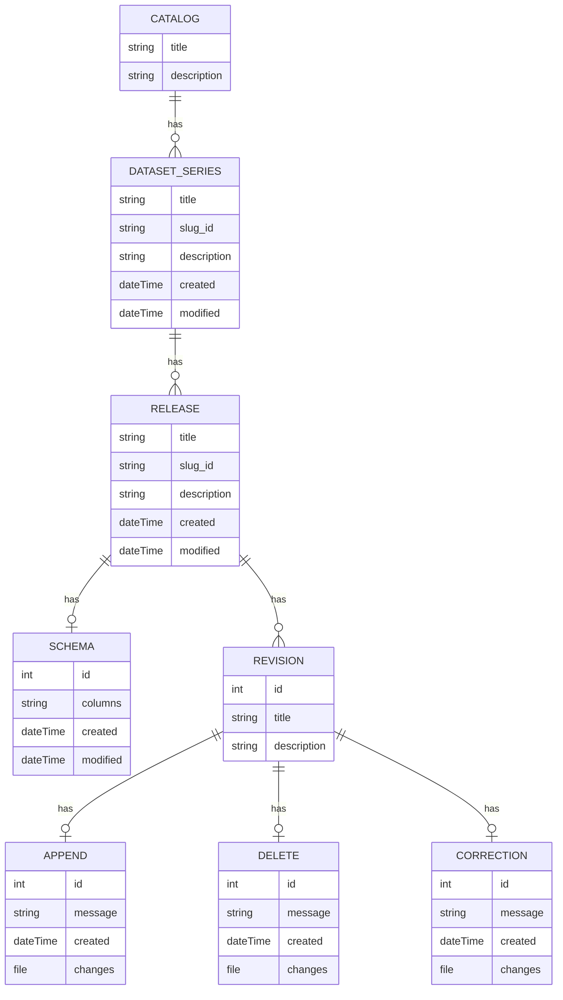

```mermaid
erDiagram
    CATALOG ||--o{ DATASET_SERIES : has

    CATALOG {
        string title
        string description
    }

    DATASET_SERIES {
        string title
        string slug_id
        string description
        dateTime created
        dateTime modified
    }

    RELEASE {
        string title
        string slug_id
        string description
        dateTime created
        dateTime modified
    }

    SCHEMA {
        int id
        string columns
        dateTime created
        dateTime modified
    }

    REVISION {
        int id
        string title
        string description
    }

    APPEND {
        int id
        string message
        dateTime created
        file changes
    }

    DELETE {
        int id
        string message
        dateTime created
        file changes
    }

    CORRECTION {
        int id
        string message
        dateTime created
        file changes
    }

    DATASET_SERIES ||--o{ RELEASE : has
    RELEASE ||--o{ REVISION : has
    RELEASE ||--o| SCHEMA : has
    REVISION ||--o| APPEND : has
    REVISION ||--o| DELETE : has
    REVISION ||--o| CORRECTION : has
```
