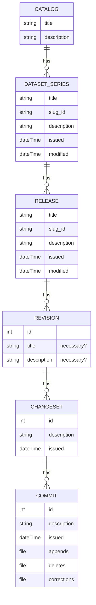

```mermaid
erDiagram
    CATALOG ||--o{ DATASET_SERIES : has

    CATALOG { 
        string title 
        string description
    }

    DATASET_SERIES { 
        string title 
        string slug_id
        string description
        dateTime issued
        dateTime modified
    }

    RELEASE { 
        string title 
        string slug_id
        string description
        dateTime issued
        dateTime modified
    }

    REVISION { 
        int id 
        string title "necessary?"
        string description "necessary?"
    }

    CHANGESET { 
        int id 
        string description
        dateTime issued
    }

    COMMIT { 
        int id 
        string description
        dateTime issued
        file appends
        file deletes
        file corrections
    }

    DATASET_SERIES ||--o{ RELEASE : has
    RELEASE ||--o{ REVISION : has
    REVISION ||--o{ CHANGESET : has
    CHANGESET ||--o{ COMMIT : has 

```
